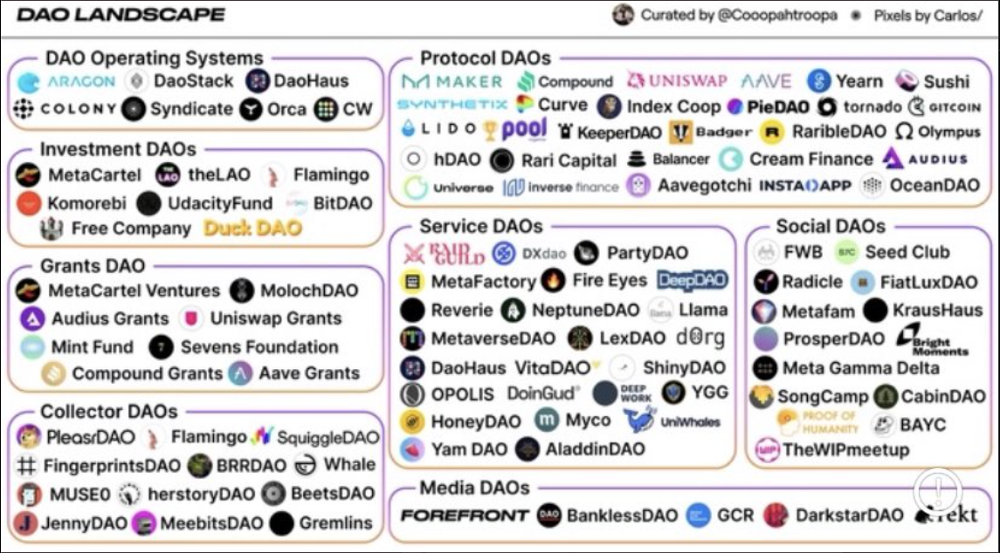

**Protocol DAOs:**
  - [[MakerDAO]]
  - [[Compound]]
  - [[Uniswap]]
  - [[Aave]]

**DAO Operating Systems:**
  - [[Aragon]]
  - [[DAOstack]]

- **Tokens:**
  - [[Dash]]
  - [[Decred]]
  - [[SushiSwap]]
  - [[Synthetix]]
  - [[0x]]
  - **More:**
    - [[Curve DAO Token]]
    - [[UMA]]
    - [[Stratis]]
    - [[Badger DAO]]
    - [[Balancer]]
    - [[Kyber Network Crystal v2]]
    - [[Illuvium]]
    - [[Mango Markets]]
    - [[BitDAO]]
    - [[Alien Worlds]]
    - [[DFI.Money]]
    - [[Ampleforth Governance Token]]
    - [[Harvest Finance]]
    - [[Rari Governance Token]]
    - [[Rarible]]
    - [[BarnBridge]]
    - [[Akropolis]]
    - [[cVault.finance]]
    - [[Flamingo]]
    - [[Aavegotchi]]
    - [[unFederalReserve]]
    - [[Cream Finance]]
    - [[Dego Finance]]
    - [[MANTRA DAO]]
    - [[Edgeware]]
    - [[PIVX]]
    - [[PowerPool]]
    - [[DeXe]]
    - [[pNetwork]]
    - [[Navcoin]]
    - [[Aragon Court]]
    - [[Reflexer Ungovernance Token]]
    - [[DXdao]]
    - [[Dora Factory]]
    - [[Pickle Finance]]
    - [[Idle]]
    - [[dHedge DAO]]
    - [[mStable Governance Token: Meta (MTA)]]
    - [[EasyFi]]
    - [[Swerve]]
    - [[Autonio]]
    - [[Pillar]]
    - [[Niftyx Protocol]]
    - [[YAM V3]]
    - [[Opium]]
    - [[Horizon Protocol]]
    - [[OctoFi]]
    - [[YF Link]]
    - [[NFT]]
    - [[Hakka.Finance]]
    - [[PieDAO DOUGH v2]]
    - [[Governor DAO]]
    - [[YFDAI.FINANCE]]
    - [[Digix Gold Token]]
    - [[Parachute]]
    - [[DMM: Governance]]
    - [[Polyient Games Governance Token]]
    - [[FYDcoin]]
    - [[Coin Artist]]
    - [[$LONDON]]
    - [[StakerDAO]]
    - [[S.Finance]]
    - [[Jigstack]]
    - [[BiShares]]
    - [[Index Cooperative]]
    - [[DEUS Finance]]
    - [[Bancor Governance Token]]
    - [[DFOhub]]
    - [[governance ZIL]]
    - [[BUILD Finance]]
    - [[Dextoken]]
    - [[TruePNL]]
    - [[CrossFi]]
    - [[Kyber Network Crystal Legacy]]
    - [[yfBeta]]
    - [[Ymen.Finance]]
    - [[Contribute]]
    - [[Metric Exchange]]
    - [[BondAppétit Governance Token]]
    - [[Creditbit]]
    - [[Decision Token]]
    - [[Based Money]]
    - [[Rebased]]
    - [[Encointer]]
    - [[Percent]]
    - [[Unbound]]
    - [[xETH-G]]
    - [[Universal Dollar]]
    - [[ADAM Oracle]]